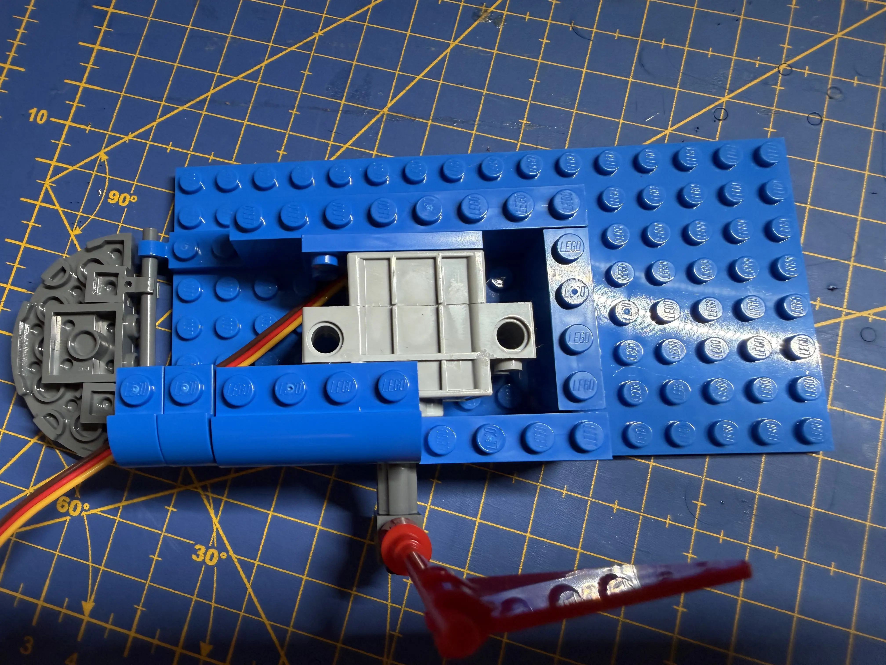
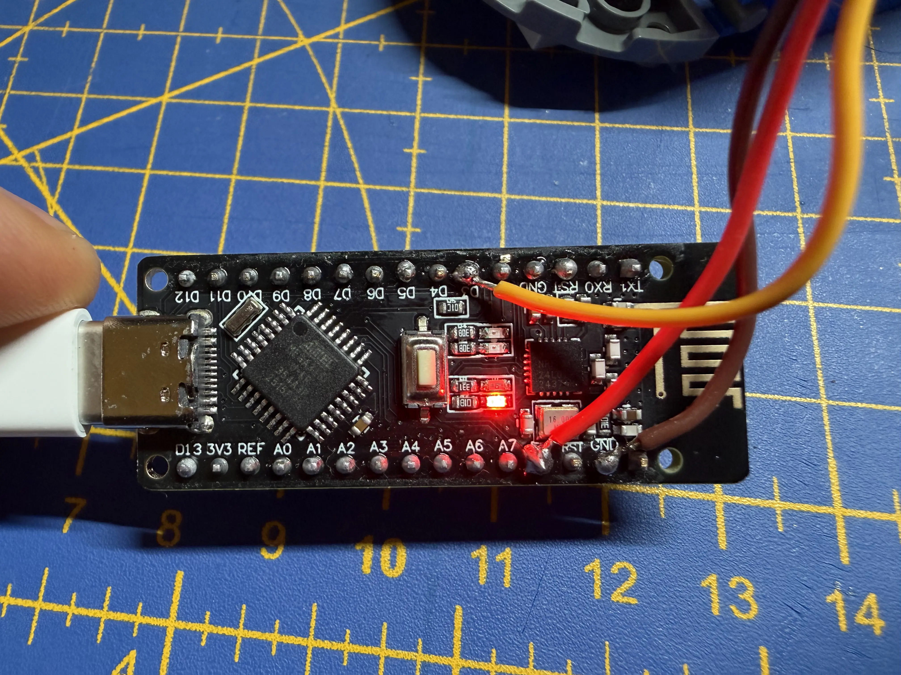
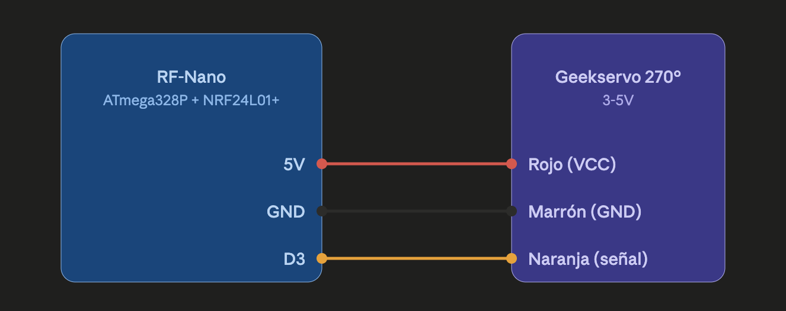

# Claude Code Lego Flag

A physical Lego mailbox with a motorised flag that tells you when Claude Code
is working vs. ready for your next prompt. A servo raises the flag when Claude
finishes a response and lowers it as soon as you send a new message.

It's a tiny ambient signal you can see from the corner of your eye — no
terminal bells, no polling your screen.

[](https://www.youtube.com/watch?v=u6cx7Jbch5Y)

## How it feels

| State           | Flag     | Trigger                                                 |
| --------------- | -------- | ------------------------------------------------------- |
| Claude thinking | **down** | Claude Code `UserPromptSubmit` hook fires on your input |
| Claude idle     | **up**   | Claude Code `Stop` / `SessionEnd` hook fires            |

A third command, `W` (wave), raises the flag for 1.5 s and drops it again —
handy for notifications or testing.

## Bill of materials

| Part                  | Notes                                                           |
| --------------------- | --------------------------------------------------------------- |
| RF-Nano V3.0          | Arduino Nano clone with integrated NRF24L01 + CH340 USB-serial. Sold in Micro-USB and USB-C variants — any works. |
| Geekservo 270°        | 3–5 V programmable servo with Lego-compatible horn.             |
| Dupont M-M jumpers    | Or solder directly to the Nano (see note below).                |
| Lego bricks + flag piece | Any small mailbox-style build that fits a 2x2 servo and a flag. |
| USB cable             | Match the Nano variant (Micro-USB or USB-C).                     |

On macOS the CH340 is recognised by the built-in `AppleUSBCHCOM` driver —
no install needed. The port appears as `/dev/cu.usbserial-*`.

### Lego model

The mailbox was designed in [Mecabricks](https://mecabricks.com/en/workshop/0DvYleNWj9e)
before buying any bricks, so the build was known to fit around the RF-Nano
and the Geekservo from day one.


### Build notes

- The NRF24L01 module on the RF-Nano uses **D9–D13**. Keep those pins free
  if you plan to extend the project.
- Clip the Geekservo horn onto the flag piece first, then fit the servo
  into the mailbox — that way you can test rotation range before committing.

  

- To fit everything inside a compact mailbox, you can cut the Nano's header
  pins flush and solder the servo wires directly to the board pads (5V, GND,
  D3). Not required if your enclosure is tall enough to keep the headers.

  

## Wiring

| Geekservo     | RF-Nano |
| ------------- | ------- |
| Red (VCC)     | 5V      |
| Brown (GND)   | GND     |
| Orange (signal) | D3    |



## Flashing the sketch

The sketch uses the stock `Servo` library and assumes a standard Nano
bootloader (`atmega328`, **not** the "old bootloader" variant).

Using [`arduino-cli`](https://arduino.github.io/arduino-cli/):

```sh
arduino-cli core install arduino:avr
arduino-cli lib install Servo

# Find your board
arduino-cli board list
# Example port: /dev/cu.usbserial-110

arduino-cli compile --fqbn arduino:avr:nano:cpu=atmega328 flag
arduino-cli upload -p /dev/cu.usbserial-110 \
    --fqbn arduino:avr:nano:cpu=atmega328 flag
```

You can also open `flag/flag.ino` in the Arduino IDE and hit Upload.

## Calibrating the flag angles

The `DOWN_POS` and `UP_POS` constants in `flag/flag.ino` are calibrated for
**our** specific mount (how the Geekservo horn is clipped onto the Lego flag
piece). Depending on the rotation at which you press the horn onto the servo
splines, your angles will be different — sometimes very different.

To find yours:

1. Flash the sketch as-is.
2. Open a serial monitor at 9600 baud (e.g. `arduino-cli monitor -p /dev/cu.usbserial-110 -c baudrate=9600`).
3. Send `U` and `D` characters and watch the flag.
4. Edit `UP_POS` / `DOWN_POS` until "down" is horizontal and "up" is vertical
   for your build. Re-flash.

If no combination of angles works, re-clip the horn onto the servo one
spline over and try again.

## Wiring up Claude Code hooks

The `hooks/notify-arduino.py` script opens the serial port, sends a single
character (`U`, `D`, or `W`), and exits. It's designed to be called from
Claude Code [hooks](https://docs.claude.com/en/docs/claude-code/hooks).

### 1. Install pyserial

```sh
/usr/bin/python3 -m pip install --user pyserial
```

### 2. Copy the script into your Claude config

```sh
mkdir -p ~/.claude/hooks
cp hooks/notify-arduino.py ~/.claude/hooks/
chmod +x ~/.claude/hooks/notify-arduino.py
```

### 3. Register the hooks

Open `~/.claude/settings.json` and merge the snippet from
`hooks/settings.example.json` into the top-level `"hooks"` key. Replace
`/Users/YOU` with your actual home path, or use `~` if your shell expands it
in that context.

The snippet wires three events:

- **`UserPromptSubmit`** → send `D` (flag down, Claude is working)
- **`Stop`** → send `U` (flag up, Claude is done)
- **`SessionEnd`** → send `D` (clean up on exit)

Each command is wrapped in `nohup … &` so the hook returns instantly — the
serial handshake (~2 s) doesn't block your prompt.

Restart your Claude Code session after editing `settings.json`.

## How it works

```
Claude Code event ──▶ hook command
                         │
                         ▼
                 notify-arduino.py U|D|W
                         │  (opens /dev/cu.usbserial-*)
                         ▼
                  ┌──────────────┐       ┌────────────┐
                  │   RF-Nano    │──D3──▶│ Geekservo  │──▶ flag
                  │  (flag.ino)  │       │   270°     │
                  └──────────────┘       └────────────┘
```

The Arduino sketch is a trivial serial state machine: on each received
character it moves the servo and echoes the action back (`UP`, `DOWN`,
`WAVE`) — useful for debugging from a serial monitor.

## Troubleshooting

The hook script swallows errors silently (so it never disrupts Claude Code)
and logs to `/tmp/notify-arduino.log`. When the flag stops moving:

```sh
tail -n 20 /tmp/notify-arduino.log
```

Common causes:

- **`pyserial missing`** — install it into `/usr/bin/python3` (the exact
  interpreter the hook invokes).
- **`no serial port matching …`** — the Nano isn't plugged in, or it enumerates
  under a glob the script doesn't cover. Check `ls /dev/cu.*` and extend
  `PORT_GLOBS` if needed.
- **`serial error on /dev/cu.…: [Errno 16] Resource busy`** — another process
  (Arduino IDE serial monitor, another Claude Code session) is holding the
  port. Close it.
- **Flag moves to weird angles** — re-calibrate `UP_POS` / `DOWN_POS` as
  described above.

## Repository layout

```
.
├── flag/
│   └── flag.ino              # Arduino sketch (serial → servo)
├── hooks/
│   ├── notify-arduino.py     # Python script called by Claude Code hooks
│   └── settings.example.json # Snippet to merge into ~/.claude/settings.json
├── docs/
│   ├── wiring-diagram.png
│   ├── lego-render.gif
│   ├── servo-fit.webp
│   └── soldering.webp
├── LICENSE
└── README.md
```

## License

[MIT](LICENSE).
